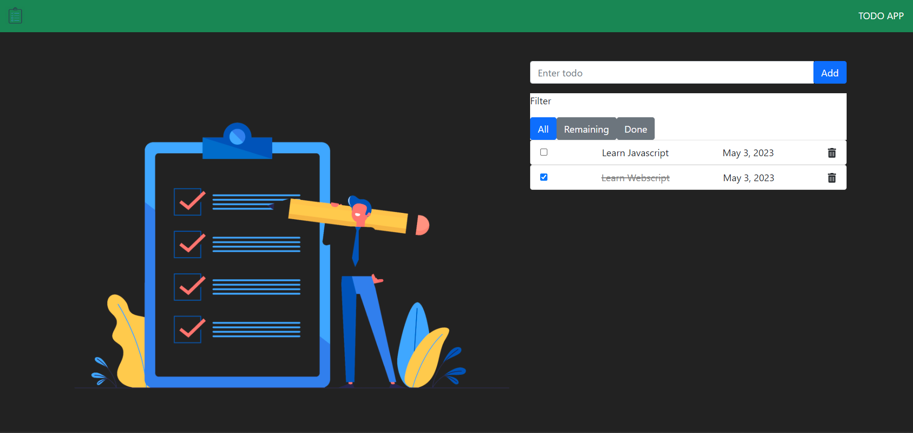

# TodoApp

Projet WE, par Yoann DEWILDE.

## Idée

Le projet de base était une TodoList, dont ce dépôt est un fork. Je l'ai modifiée pour y ajouter un filtre pour afficher les tâches :
* terminée,
* en cours,
* toutes les tâches.

L'ensemble des modifications effectuées sont commentées avec `MODIF`.

Voici l'interface finale :

## Architecture

Il y a 3 composants : 
* `todos`: la liste des todos,
* `todo-form`: input pour créer une tâche,
* `todo-filter`: filtres (que j'ai créé).

Quand on clique sur un bouton du filtre, l'information va au composant `todos` via `app`. Ce changement de filtre déclenche `Todos.ngOnChanges`, qui met à jour les tâches à afficher.

## Bug

Quand on a un filtre autre que `all` sélectionné, et qu'on ajoute une tâche, il n'y a pas de mise à jour. Il faut cliquer sur un autre filtre pour qu'elle soit prise en compte.

## Difficultés rencontrées

Je n'ai pas trop compris le système d'Observable utilisé. J'ai donc modifié directement la liste à afficher, sans passer par l'observable. C'est peut-être cela qui cause le bug.